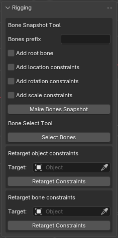
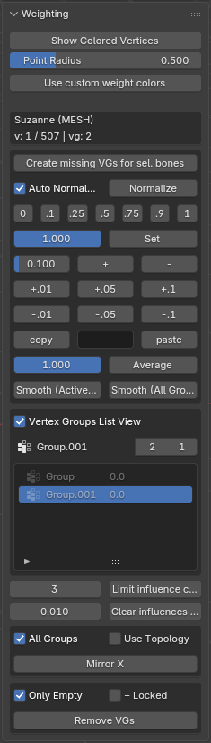
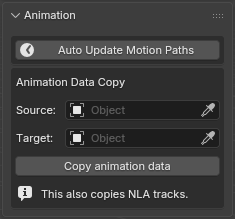
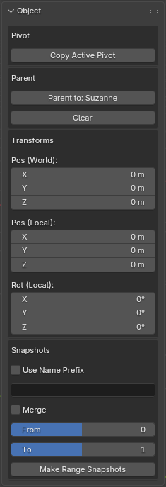
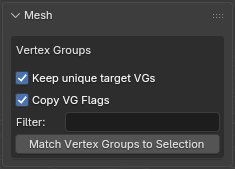
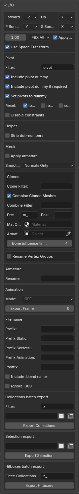
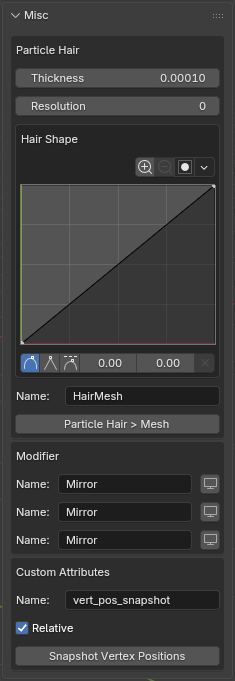

# MGTools — Quick Reference

---

## Table of contents
- [Rigging](#rigging)
- [Weighting](#weighting)
- [Animation](#animation)
- [Object](#object)
- [Mesh](#mesh)
- [Renaming](#renaming)
- [I/O (Export)](#io-export)
- [Misc](#misc)

---

<table>
<tr>
<td valign="top" align="left">

</td>
<td valign="top">

## Rigging
- Purpose: snapshot, selection, and constraint retarget tools for armatures.
- Features:
  - **Bone Snapshot Tool**: clone bones with a configurable prefix, add a root bone, and optionally add location/rotation/scale constraints to cloned bones.
  - **Bone Select Tool**: helpers to select bones quickly.
  - **Retarget Constraints**: retarget object-level and bone-level constraints to another target object.

</td>
</tr>
</table>

---

<table>
<tr>
<td valign="top" align="left">

</td>
<td valign="top">

## Weighting
- Purpose: display and edit vertex group weights, shortcuts, and utilities to manage weights.
- Features:
  - Toggle weight display and customize weight-point radius.
  - Use custom weight color range (`Preferences > View`) or default colors.
  - Weight tools: create missing vertex groups, normalize weights, set quick weight values (0, .1, .25, .5, .75, .9, 1), add/subtract weight offsets, copy/paste weights, average and smooth operations.
  - Mirror weights options (topology-aware or naive mirror).
  - Remove empty or locked vertex groups and limit influences per vertex.
  - Vertex group list view with advanced filtering and sorting (average-weight based filtering).

</td>
</tr>
</table>

---

<table>
<tr>
<td valign="top" align="left">

</td>
<td valign="top">

## Animation
- Purpose: motion path automation and copying animation data (including NLA tracks).
- Features:
  - **Auto Update Motion Paths**: toggle automatic motion path updates.
  - **Copy Animation Data**: select a Source and Target object and copy animation data (actions and NLA tracks).

</td>
</tr>
</table>

---

<table>
<tr>
<td valign="top" align="left">

</td>
<td valign="top">

## Object
- Purpose: convenience tools for object-level transforms, parenting, pivot handling and snapshots.
- Features:
  - **Pivot**: copy active pivot to selected objects.
  - **Parent**: parent objects to the active or clear parent.
  - **Transforms**: set world/local location and local rotation from UI props.
  - **Snapshots**: create snapshots of objects over a frame range; options for prefixing and merging.

</td>
</tr>
</table>

---

<table>
<tr>
<td valign="top" align="left">

</td>
<td valign="top">

## Mesh
- Purpose: mesh-focused utilities, mostly vertex group management.
- Features:
  - **Vertex Groups**: options to keep unique target VGs, copy vertex-group flags, a name filter, and an operator to match vertex groups to the selection.

</td>
</tr>
</table>

---

<table>
<tr>
<td valign="top" align="left">

</td>
<td valign="top">

## Renaming
- Purpose: rename bones, vertex groups and animation curve groups using mapping files and quick tools.
- Features:
  - **Rename with mapping**: provide a mapping file (text file in `old:new;` format) and optionally invert the mapping direction.
  - **Prefixes**: `Remove prefix` and `Add prefix` fields (applied after mapping — removal of a leading prefix is case-sensitive and removes only the first leading occurrence; adding avoids duplication).
  - Operators (buttons in the UI): Rename Bones, Rename Vertex Groups, Rename FCurves. Convenience tools are also available to print names and set mesh data names from object names.

</td>
</tr>
</table>

---

<table>
<tr>
<td valign="top" align="left">

</td>
<td valign="top">

## I/O (Export)
- Purpose: export configuration and batch export operations.
- Features grouped by sections:
  - **Axis**: set forward / up axes and bone axes.
  - **Scale**: export scale and scaling behavior.
  - **Pivot**: configure pivot filter prefix and options to include pivot dummies and reset transforms.
  - **Helper**: strip dot-number suffixes from helper objects.
  - **Mesh / Clones**: options for applying modifiers, combining cloned meshes, clone filters, prefix/postfix for object names, material override and armature replacement.
  - **Vertex Groups Rename (I/O)**: enable vertex group renaming during export using a mapping file, with an option to invert the mapping and inline Remove/Add prefix fields (applied during export).
  - **Animation**: bake and mode options for animation export.
  - **File name**: configure filename prefixes/postfix and collection/selection export shortcuts.
  - **Collection/Selection Export**: export entire collections or active selection via provided paths and operators.
  - **Hitboxes**: batch export hitbox collections with filter.

</td>
</tr>
</table>

---

<table>
<tr>
<td valign="top" align="left">

</td>
<td valign="top">

## Misc
- Purpose: assorted tools that don't fit other sections.
- Features:
  - **Particle Hair → Mesh**: convert particle hair to mesh with thickness, resolution, and hair-shape curve mapping.
  - **Modifier Toggle**: quick UI to toggle named modifiers on the active object.
  - **Custom Attributes**: snapshot vertex positions to an attribute (name + relative option).

</td>
</tr>
</table>
